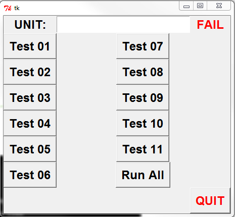

This is a simple program created to interface with a series 6000 SCI hipot tester over a USB to serial adapter. These units were formerly known as 'Slaughter' brand testers.

http://www.hipot.com/products/6000.aspx

No need to use HyperTerminal or other serial console to start tests and retrieve results. This also has some additional code to store the results in an MySQL database along with the serial number of the item being tested. You must have PySerial and (optional) MySQLdb installed.

